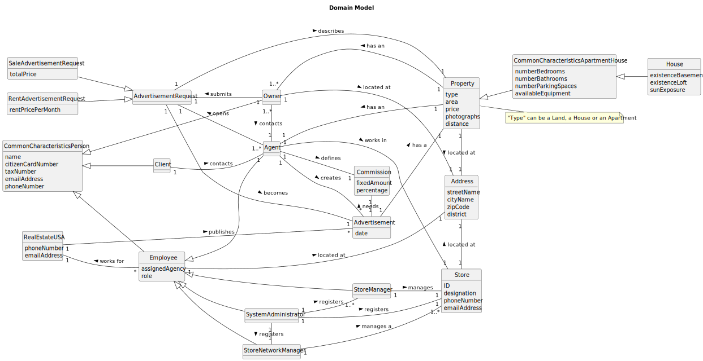

# Analysis

The construction process of the domain model is based on the client specifications, especially the nouns (for _concepts_) and verbs (for _relations_) used. 

## Rationale to identify domain conceptual classes ##
To identify domain conceptual classes, start by making a list of candidate conceptual classes inspired by the list of categories suggested in the book "Applying UML and Patterns: An Introduction to Object-Oriented Analysis and Design and Iterative Development". 

### _Conceptual Class Category List_ ###

**Business Transactions**

* n/a

---

**Transaction Line Items**

* n/a

---

**Product/Service related to a Transaction or Transaction Line Item**

* Advertisement 

---

**Transaction Records**

* n/a 

---  

**Roles of People or Organizations**

* Owner
* Agent
* System Administrator
* Store Manager
* Store Network Manager
* Client

---

**Places**

* Property
* Store

---

**Noteworthy Events**

* n/a

---

**Physical Objects**

* n/a

---

**Descriptions of Things**

* CommonCharacteristicsApartmentHouse
* CommonCharacteristicsPerson

---

**Catalogs**

* n/a 

---

**Containers**

* n/a

---

**Elements of Containers**

* n/a 

---

**Organizations**

* RealEstateUSA

---

**Other External/Collaborating Systems**

* n/a

---

**Records of finance, work, contracts, legal matters**

* n/a

---

**Financial Instruments**

* n/a 

---

**Documents mentioned/used to perform some work/**

* n/a
---

###**Rationale to identify associations between conceptual classes**###

An association is a relationship between instances of objects that indicates a relevant connection and that is worth of remembering, or it is derivable from the List of Common Associations: 

+ **_A_** is physically or logically part of **_B_**
+ **_A_** is physically or logically contained in/on **_B_**
+ **_A_** is a description for **_B_**
+ **_A_** known/logged/recorded/reported/captured in **_B_**
+ **_A_** uses or manages or owns **_B_**
+ **_A_** is related with a transaction (item) of **_B_**
+ etc.

| Concept (A) 		             | Association            	                                               | Concept (B)                                                                              |                    
|:---------------------------|------------------------------------------------------------------------|:-----------------------------------------------------------------------------------------|
| Advertisement 	            | needs   has a                                                     | Comission   Property                                                                |
| Store Manager              | is a   manages  		 	                                              | Employee   Store                                                                    |                       
| System Administrator       | registers   registers   registers   is a   manages | Store Network Manager   Store Manager   Store   Employee                  |
| Store Network Manager      | is a   manages                                                    | Employee   Store                                                                    |
| Store                      | located at                                                             | Address                                                                                  |
| Employee                   | works for   located at                                            | Real Estate USA   Address                                                           |
| Agent                      | works in   defines   creates   opens   is a        | Store   Comission   Advertisement   Advertisement Request   Employee |
| Client                     | contacts                                                               | Agent                                                                                    |
| Owner                      | located at   contacts   submits                              | Address   Agent   Advertisement Request                                        |
| Property                   | located at   has an   has an                                 | Address   Owner   Agent                                                        |
| Advertisement Request      | describes   becomes                                               | Property   Advertisement                                                            |
| Sale Advertisement Request | is a                                                                   | Advertisement Request                                                                    |
| Rent Advertisement Request | is a                                                                   | Advertisement Request                                                                    |
| Real Estate USA            | publishes                                                              | Advertisement                                                                            |

## Domain Model

