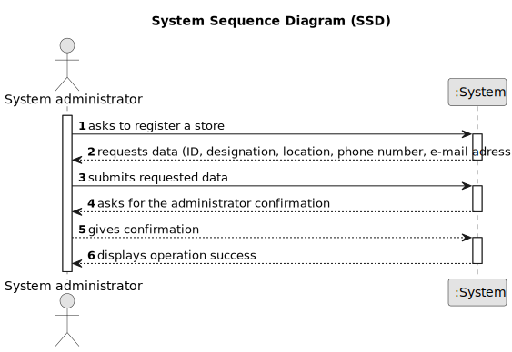

# US 005 - To register a new Store

## 1. Requirements Engineering

### 1.1. User Story Description

As a system administrator, I want to register a store.

### 1.2. Customer Specifications and Clarifications

**From the specifications document:**

> The company's systems administrator will be responsible for registering branches of the network (specifying
> the designation, location and local manager).

> Each store in the network has a store manager and the set of stores is managed by a store network
> manager.

> The main functions of a store manager are to monitor and streamline the branch with the
> aim of getting to know better the business carried out and to analyse and evaluate the performance
> of employees.

**From the client clarifications:**

> **Question:** When a System Administrator (admin) makes a request to register a new network branch (or any other
 alteration), does the System ask for the admin credentials (login, password)?
>
> **Answer:** The System Administrator should be logged in the application.

> **Question:** Can there be more than one admin?
>
> **Answer:** No.

> **Question:** Is the store manager also an agent ?
>
> **Answer:** No.

> **Question:** There is only one manager for each store and only one system administrator ?
>
> **Answer:** Yes.

> **Question:** Is there only one network of stores?
>
> **Answer:** Yes.

> **Question:** Could you please share how will the designation of new stores be made, is there a pattern perhaps?
>
> **Answer:** There is no pattern. The System Administrator can introduce any designation/name. The designation/name should have at most forty characters.

> **Question:**  Will the System Administrator be able to choose a location from a list of available locations (defined elsewhere in the application) or will he be able to submit any location he wants?
>
> **Answer:** The System Administrator can submit any location.

> **Question:** Are the local managers restricted to their initial location or can they be re-registered/reassigned to other locations?
>
> **Answer:** For now this is not a problem.
 

### 1.3. Acceptance Criteria

* **AC1:** Each store in the network has a store manager and the set of stores is managed by a store network
  manager.
* **AC2:** There is only one network of stores.
* **AC3:** There is only one store manager for each store.
* **AC4:** The designation should have at most forty characters.
* **AC5:** The ID is an integer number.

### 1.4. Found out Dependencies

* There is no dependencies.

### 1.5 Input and Output Data

**Input Data:**

* Typed data:
    * ID
    * a designation
    * a location (streetName, cityName, zipCode, district)
    * a phone number
    * e-mail address

**Output Data:**

* (In)Success of the operation

### 1.6. System Sequence Diagram (SSD)

**Other alternatives might exist.**

#### Alternative One

### 1.7 Other Relevant Remarks

 * n/a