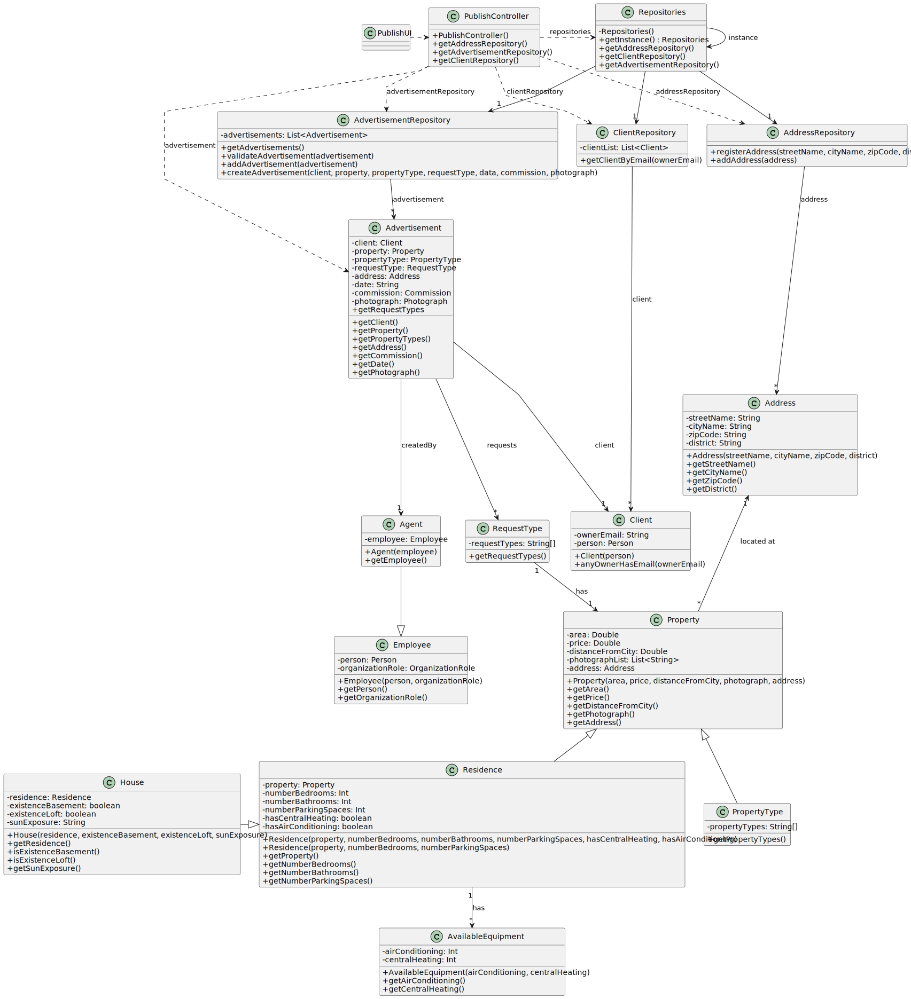

# US 002 - To publish a sale 

## 3. Design - User Story Realization 

### 3.1. Rationale

**SSD - Alternative 1 is adopted.**

| Interaction ID                                                                                             | Question: Which class is responsible for...        | Answer                   | Justification (with patterns)                                                                    |
|:-----------------------------------------------------------------------------------------------------------|:---------------------------------------------------|:-------------------------|:-------------------------------------------------------------------------------------------------|
| Step 1: the agent asks to publish a sale announcement		                                                    | 	... interacting with the agent?                   | PublishUI                | Pure Fabrication                                                                                 |
| 			  		                                                                                                    | 	... coordinating the US?                          | PublishUIController      | Controller                                                                                       |
|                                                                                                            | ... knowing the owners in the system?              | AuthenticationRepository | Creator (Rule 1): AuthenticationRepository contains all the owner's email present in the system. |
|                                                                                                            | ... knowing the addresses in the system?           | AddressRepository        | Creator (Rule 2): AddressRepository contains all the addresses present in the system.            |
|                                                                                                            | ...knowing the types of properties in the system?  | PropertyRepository       | Creator (Rule 3): PropertyRepository contains all the properties present in the system.          |
|                                                                                                            | ...knowing the advertisements in the system?       | AdvertisementRepository  | Creator (Rule 4): AdvertisementRepository contains all the advertisements present in the system. |
|                                                                                                            | ...knowing the clients in the system?              | ClientRepository         | Creator (Rule 5): ClientRepository contains all the clients present in the system.               |
| Step 2: request data (i.e. owner's email) 		                                                               | ...displaying the data?							                     | PublishUI                | Pure Fabrication                                                                                 |
| Step 3: type request data 		                                                                               | 	...validating submitted data?                     | ClientRepository         | Pure Fabrication                                                                                 |
| Step 4: show type of request list (i.e. sale or rent) and ask to select one 		                             | ...displaying types of request options?							     | PublishUI                | Pure Fabrication                                                                                 |
| Step 5: select type of request  		                                                                         | 	...selects the type of request?                   | PublishUI                | Pure Fabrication                                                                                 |
|                                                                                                            | ...setting type of request?                        | RequestType              | Pure Fabrication                                                                                 |
| Step 6: request data (i.e. total price)                                                                    | ...displaying the data?                            | PublishUI                | Pure Fabrication                                                                                 |
| Step 7: type requested data                                                                                | ...validating the data?                            | PublishUI                | Pure Fabrication                                                                                 |
| Step 8: request data (i.e. price per month)                                                                | ...displaying the data?                            | PublishUI                | Pure Fabrication                                                                                 |
| Step 9: type request data                                                                                  | ...validating the data?                            | PublishUI                | Pure Fabrication                                                                                 |
| Step 10: show type of property list (i.e. apartment, house or land) and ask to select one 				  		         | ...displaying the types of property options? 	     | PublishUI                | Pure Fabrication                                                                                 | 
| Step 11: select type of property			  		                                                                    | 	...selects the type of property?                  | PublishUI                | Pure Fabrication                                                                                 | 
|                                                                                                            | ...setting type of property?                       | Property                 | Pure Fabrication                                                                                 |
| Step 12: request data (i.e. area (m2) and distance from the city centre)  		                               | 	...displaying the data?                           | PublishUI                | Information Expert. The object created has its own data.                                         | 
| Step 13: type requested data                                                                               | ...validating submitted data?                      | PublishController        | Pure Fabrication                                                                                 |
| Step 14: request data (i.e. address (i.e. street name, city name, zip code and district)                   | ...displaying the data?                            | AddressRepository        | Information Expert. The object created has its own data.                                         |
| Step 15: type requested data                                                                               | ...validating the data locally?                    | PublishController        | Pure Fabrication                                                                                 |
|                                                                                                            | ...creating the address?                           | Address                  | Information Expert. The object created has its own data.                                         |
| Step 16: request data (i.e. URI)                                                                           | ...displaying the data?                            | PublishUI                | Pure Fabrication                                                                                 |
| Step 17: type requested data                                                                               | ...validating submitted data?                      | PublishUI                | Pure Fabrication                                                                                 |
|                                                                                                            | ...creating a property?                            | Property                 | Information Expert. The object created has its own data.                                         |
|                                                                                                            | ...validating the data locally?                    | PropertyRepository       | Information Expert. The object created has its own data.                                         |
| Step 18: request data (i.e. number of bedrooms and parking spaces)                                         | ...displaying the data?                            | PublishUI                | Pure Fabrication                                                                                 |
| Step 19: type requested data                                                                               | ...validating submitted data?                      | PublishUI                | Pure Fabrication                                                                                 |
| Step 20: request data (i.e. number of bathrooms)                                                           | ...displaying the data?                            | PublishUI                | Pure Fabrication                                                                                 |
| Step 21: type requested data                                                                               | ...validating submitted data?                      | PublishUI                | Pure Fabrication                                                                                 |
| Step 22: show available equipment list (i.e. central heating and air conditioning) and ask to select one 	 | ...displaying the data?                            | PublishUI                | Pure Fabrication                                                                                 |
| Step 23: type requested data                                                                               | ...validating submitted data?                      | PublishUI                | Pure Fabrication                                                                                 |
|                                                                                                            | ...creating a residence?                           | Residence                | Information Expert. The object created has its own data.                                         |
|                                                                                                            | ...validating the data locally?                    | ResidenceRepository      | Information Expert. The object created has its own data.                                         |
| Step 24: show basement options (i.e. yes or no) and ask to select one 	                                    | ...displaying the data?                            | PublishUI                | Pure Fabrication                                                                                 |
| Step 25: type requested data                                                                               | ...validating submitted data?                      | PublishUI                | Pure Fabrication                                                                                 |
| Step 26: show loft options (i.e. yes or no) and ask to select one 	                                        | ...displaying the data?                            | PublishUI                | Pure Fabrication                                                                                 |
| Step 27: type requested data                                                                               | ...validating submitted data?                      | PublishUI                | Pure Fabrication                                                                                 |
| Step 28: show sun exposure list (i.e. north, south, east or west) and ask to select one 	                  | ...displaying the data?                            | PublishUI                | Pure Fabrication                                                                                 |
| Step 29: type requested data                                                                               | ...validating submitted data?                      | PublishUI                | Pure Fabrication                                                                                 |
|                                                                                                            | ...creating a house?                               | House                    | Information Expert. The object created has its own data.                                         |
|                                                                                                            | ...validating the data locally?                    | HouseRepository          | Information Expert. The object created has its own data.                                         |
| Step 30: show type of commission list (i.e. fixed amount or percentage) and ask to select one 		           | ...displaying types of commissions options?							 | PublishUI                | Pure Fabrication                                                                                 |
| Step 31: select type of commission  		                                                                     | 	...selects the type of commissions?               | PublishUI                | Pure Fabrication                                                                                 |
|                                                                                                            | ...setting type of commission?                     | CommissionType           | Pure Fabrication                                                                                 |
| Step 32: request data (i.e. fixed amount)                                                                  | ...displaying the data?                            | PublishUI                | Pure Fabrication                                                                                 |
| Step 33: type requested data                                                                               | ...validating submitted data?                      | PublishUI                | Pure Fabrication                                                                                 |
| Step 34: request data (i.e. percentage)                                                                    | ...displaying the data?                            | PublishUI                | Pure Fabrication                                                                                 |
| Step 35: type request data                                                                                 | ...validating submitted data?                      | PublishUI                | Pure Fabrication                                                                                 |
| Step 36: show data and ask for confirmation                                                                | ...displaying a summary of submitted data?         | PublishUI                | Pure Fabrication                                                                                 |
| Step 37: confirm                                                                                           | ...validating the data?                            | AdvertisementRepository  | Information Expert. The object created has its own data.                                         |
|                                                                                                            | ...creating the advertisement?                     | Advertisement            | Information Expert. The object created has its own data.                                         |
|                                                                                                            | ...validating the data locally?                    | AdvertisementRepository  | Information Expert. The object created has its own data.                                         |
| Step 38: display operation success                                                                         | ...informing operation success?                    | PublishUI                | Pure Fabrication                                                                                 |

### Systematization ##

According to the taken rationale, the conceptual classes promoted to software classes are: 

* RequestType
* Advertisement
* Address
* Property
* CommissionType

Other software classes (i.e. Pure Fabrication) identified: 

* PublishUI
* PublishController
* AddressRepository
* ClientRepository
* AdvertisementRepository
* PropertyRepository

## 3.2. Sequence Diagram (SD)

### Full Diagram

This diagram shows the full sequence of interactions between the classes involved in the realization of this user story.

## 3.3. Class Diagram (CD)

