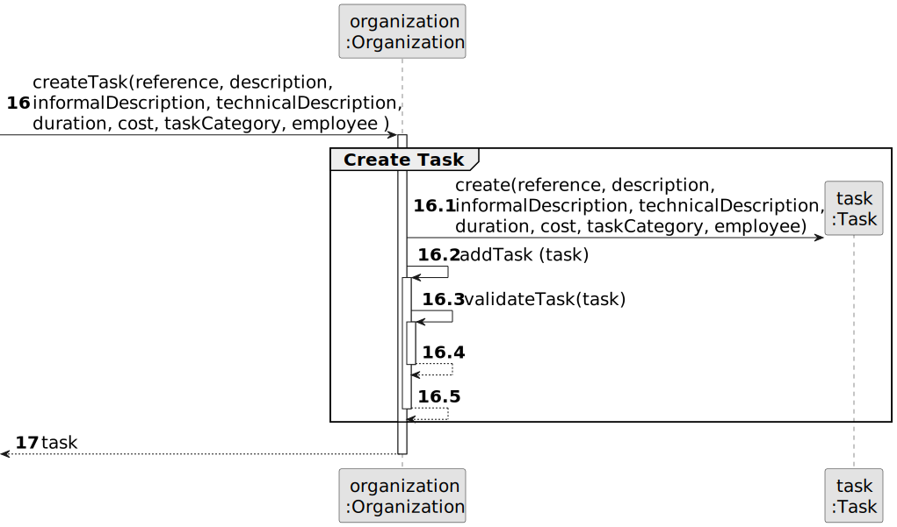

# US 003 - Register a new employee

## 3. Design - User Story Realization 

### 3.1. Rationale

**SSD - Alternative 1 is adopted.**

| Interaction ID | Question: Which class is responsible for... | Answer                     | Justification (with patterns)                                                                                 |
|:---------------|:--------------------------------------------|:---------------------------|:--------------------------------------------------------------------------------------------------------------|
| Step 1  		     | 	... interacting with the actor?            | RegisterEmployeeUI         | Pure Fabrication: there is no reason to assign this responsibility to any existing class in the Domain Model. |
| 			  		        | 	... coordinating the US?                   | RegisterEmployeeController | Controller                                                                                                    |
| 			  		        | 	... instantiating a new Employee?          | EmployeeRepository         | Information Expert                                                                                            |
| 			  		        | ... knowing the user using the system?      | UserSession                | IE: cf. A&A component documentation.                                                                          |
| Step 2  		     | 		... for retriving the Role List?					     | RoleListRepository         | Information Expert                                                                                            |
|                | ...for showing the List                     | RegisterEmployeeUI         | Pure Fabrication                                                                                              |
| Step 3  		     | 	.... retriving the Agency List?            | AgencyListRepository       | Information Expert                                                                                            |
| Step 4  		     | 	... showing the List                       | RegisterEmployeeUI         | Pure Fabrication                                                                                              |
| Step 5  		     |                                             |                            |                                                                                                               |
| Step 6  		     | 							                                     |                            |                                                                                                               |              
| Step 7  		     | ...creating new employee?                   |             RegisterEmployeeController               | Controller                                                                                                    | 
|                | ... saving a new employee?                  |                       RegisterEmployeeController                                  | Controller                                                                                                    |
|                | ...creating a password?                     |                          EmployeePasswordGenerator                                                         | Pure Fabrication                                                                                              |
| Step 8  		     | 	... informing operation success?           | RegisterEmployeeUI             | Pure Fabrication                                                                                              | 

### Systematization ##

According to the taken rationale, the conceptual classes promoted to software classes are: 

 * Employee
 * Store
 * Role
 * System Administrator

Other software classes (i.e. Pure Fabrication) identified: 

 * RegisterEmployeeUI 
 * RegisterEmployeeController
 * AgencyListRepository
 * EmployeeRepository
 * RoleListRepository
 * EmployeePasswordGenerator

## 3.2. Sequence Diagram (SD)

### Alternative 1 - Full Diagram

This diagram shows the full sequence of interactions between the classes involved in the realization of this user story.

### Alternative 2 - Split Diagram

This diagram shows the same sequence of interactions between the classes involved in the realization of this user story, but it is split in partial diagrams to better illustrate the interactions between the classes.

It uses interaction ocurrence.

**Get Task Category List Partial SD**

**Get Task Category Object**

**Get Employee**

**Create Task**

## 3.3. Class Diagram (CD)

