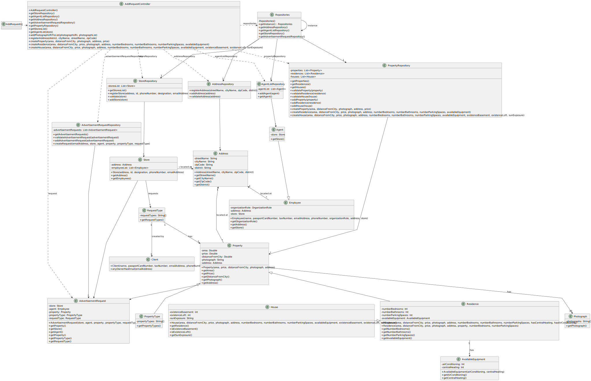

# US 004 - To submit a request 

## 3. Design - User Story Realization 

### 3.1. Rationale

**SSD - Alternative 1 is adopted.**

| Interaction ID                                                                                  | Question: Which class is responsible for...           | Answer                         | Justification (with patterns)                                                                                    |
|:------------------------------------------------------------------------------------------------|:------------------------------------------------------|:-------------------------------|:-----------------------------------------------------------------------------------------------------------------|
| Step 1: the owner asks to submit a request for listing a property 		                            | 	...interacting with the owner?                       | AddRequestUI                   | Pure Fabrication                                                                                                 |
| 			  		                                                                                         | 	...coordinating the US?                              | AddRequestController           | Controller                                                                                                       |
|                                                                                                 | ...knowing the list of stores in the system?          | StoreRepository                | Creator(Rule 1): StoreRepository contains all the stores present in the system.                                  | 
| 			  		                                                                                         | ...knowing the list of agents in the system?          | AgentListRepository            | Creator(Rule 2): AgentList contains all the agents present in the system.                                        |
|                                                                                                 | ...knowing the addresses in the system?               | AddressRepository              | Creator (Rule 3): AddressRepository contains all the addresses present in the system.                            |
|                                                                                                 | ...knowing the requests in the system?                | RequestRepository              | Creator (Rule 4): RequestRepository contains all the requests present in the system.                             |
|                                                                                                 | ...knowing the types of properties in the system?     | PropertyRepository             | Creator (Rule 5): PropertyRepository contains all the properties present in the system.                          |
|                                                                                                 | ...knowing the advertisements requests in the system? | AdvertisementRequestRepository | Creator (Rule 6): AdvertisementRequestRepository contains all the advertisements requests present in the system. |
| Step 2: show type of request list (i.e. sale or rent) and ask to select one 		                  | ...displaying types of request options?							        | AddRequestUI                   | Pure Fabrication                                                                                                 |
| Step 3: select type of request  		                                                              | 	...selects the type of request?                      | AddRequestUI                   | Pure Fabrication                                                                                                 |
|                                                                                                 | ...setting type of request?                           | RequestType                    | Information Expert. The object created has its own data.                                                         |
| Step 4: request data (i.e. total price)                                                         | ...displaying the data?                               | AddRequestUI                   | Pure Fabrication                                                                                                 |
| Step 5: type requested data                                                                     | ...validating the data?                               | AddRequestUI                   | Pure Fabrication                                                                                                 |
| Step 6: request data (i.e. price per month)                                                     | ...displaying the data?                               | AddRequestUI                   | Pure Fabrication                                                                                                 |
| Step 7: type request data                                                                       | ...validating the data?                               | AddRequestUI                   | Pure Fabrication                                                                                                 |
| Step 8: show store list and ask to select one  		                                               | 	...displaying store list options?                    | StoreRepository                | Information Expert. The object created has its own data.                                                         |
| Step 9: select a store  		                                                                      | 	... selects a store?                                 | AddRequestController           | Pure Fabrication                                                                                                 |
| Step 10: show responsible agents list and ask to select one   		                                | ...displaying the agents list options? 							        | AgentListRepository            | Pure Fabrication                                                                                                 |              
| Step 11: select the responsible agent 		                                                        | 	... selects the responsible agent?                   | AddRequestController           | Pure Fabrication                                                                                                 | 
| Step 12: show type of property list (i.e. apartment, house or land) and ask to select one		  		 | ...displaying the types of property options? 	        | AddRequestUI                   | Pure Fabrication                                                                                                 | 
| Step 13: select type of property			  		                                                         | 	...selects the type of property?                     | AddRequestUI                   | Pure Fabrication                                                                                                 | 
|                                                                                                 | ...setting type of property?                          | PropertyType                   | Information Expert. The object created has its own data.                                                         |
| Step 14: request data (i.e. area (m2) and distance from the city centre)  		                    | 	...displaying the data?                              | AddRequestUI                   | Information Expert. The object created has its own data.                                                         | 
| Step 15: type requested data                                                                    | ...validating submitted data?                         | AddRequestUI                   | Pure Fabrication                                                                                                 |
| Step 16: request data (i.e. address (i.e. street name, city name, zip code and district)        | ...displaying the data?                               | AddressRepository              | Information Expert. The object created has its own data.                                                         |
| Step 17: type requested data                                                                    | ...validating the data?                               | AddRequestUI                   | Pure Fabrication                                                                                                 |
|                                                                                                 | ...creating the address?                              | Address                        | Information Expert. The object created has its own data.                                                         |
| Step 18: request data (i.e. URI)                                                                | ...displaying the data?                               | AddRequestUI                   | Pure Fabrication                                                                                                 |
| Step 19: type requested data                                                                    | ...validating submitted data?                         | AddRequestUI                   | Pure Fabrication                                                                                                 |
|                                                                                                 | ...creating a property?                               | Property                       | Information Expert. The object created has its own data.                                                         |
|                                                                                                 | ...validating the data locally?                       | PropertyRepository             | Information Expert. The object created has its own data.                                                         |
| Step 20: request data (i.e. number of bedrooms and parking spaces)                              | ...displaying the data?                               | AddRequestUI                   | Pure Fabrication                                                                                                 |
| Step 21: type requested data                                                                    | ...validating submitted data?                         | AddRequestUI                   | Pure Fabrication                                                                                                 |
| Step 22: request data (i.e. number of bathrooms)                                                | ...displaying the data?                               | AddRequestUI                   | Pure Fabrication                                                                                                 |
| Step 23: type requested data                                                                    | ...validating submitted data?                         | AddRequestUI                   | Pure Fabrication                                                                                                 |
| Step 24: show available equipment list (i.e. central heating and air conditioning)              | ...displaying the data?                               | AddRequestUI                   | Pure Fabrication                                                                                                 |
| Step 25: type requested data                                                                    | ...validating submitted data?                         | AddRequestUI                   | Pure Fabrication                                                                                                 |
|                                                                                                 | ...creating a residence?                              | Residence                      | Information Expert. The object created has its own data.                                                         |
|                                                                                                 | ...validating the data locally?                       | PropertyRepository             | Information Expert. The object created has its own data.                                                         |
| Step 26: show basement options (i.e. yes or no) and ask to select one                           | ...displaying the data?                               | AddRequestUI                   | Pure Fabrication                                                                                                 |
| Step 27: type requested data                                                                    | ...validating submitted data?                         | AddRequestUI                   | Pure Fabrication                                                                                                 |
| Step 28: show loft options (i.e. yes or no) and ask to select one                               | ...displaying the data?                               | AddRequestUI                   | Pure Fabrication                                                                                                 |
| Step 29: type requested data                                                                    | ...validating submitted data?                         | AddRequestUI                   | Pure Fabrication                                                                                                 |
| Step 30: show sun exposure list (i.e. north, south, east or west) and ask to select one         | ...displaying the data?                               | AddRequestUI                   | Pure Fabrication                                                                                                 |
| Step 31: type requested data                                                                    | ...validating submitted data?                         | AddRequestUI                   | Pure Fabrication                                                                                                 |
|                                                                                                 | ...creating a house?                                  | House                          | Information Expert. The object created has its own data.                                                         |
|                                                                                                 | ...validating the data locally?                       | PropertyRepository             | Information Expert. The object created has its own data.                                                         |
| Step 32: show data and ask for confirmation                                                     | ...displaying a summary of submitted data?            | AddRequestUI                   | Pure Fabrication                                                                                                 |
| Step 33: confirm                                                                                | ...validating the data?                               | AdvertisementRequestRepository | Information Expert. The object created has its own data.                                                         |
|                                                                                                 | ...creating the advertisement request?                | AdvertisementRequest           | Information Expert. The object created has its own data.                                                         |
|                                                                                                 | ...validating the data locally?                       | AdvertisementRequestRepository | Information Expert. The object created has its own data.                                                         |
| Step 34: display operation success                                                              | ...informing operation success?                       | AddRequestUI                   | Pure Fabrication                                                                                                 |

### Systematization ##

According to the taken rationale, the conceptual classes promoted to software classes are: 

 * RequestType
 * Property
 * Address
 * Residence
 * House
 * AdvertisementRequest
 * Store
 * Agent

Other software classes (i.e. Pure Fabrication) identified: 

 * AddRequestUI 
 * AddRequestController
 * StoreRepository
 * AgentListRepository
 * AddressRepository
 * RequestRepository
 * PropertyRepository

## 3.2. Sequence Diagram (SD)

### Full Diagram

This diagram shows the full sequence of interactions between the classes involved in the realization of this user story.

## 3.3. Class Diagram (CD)

