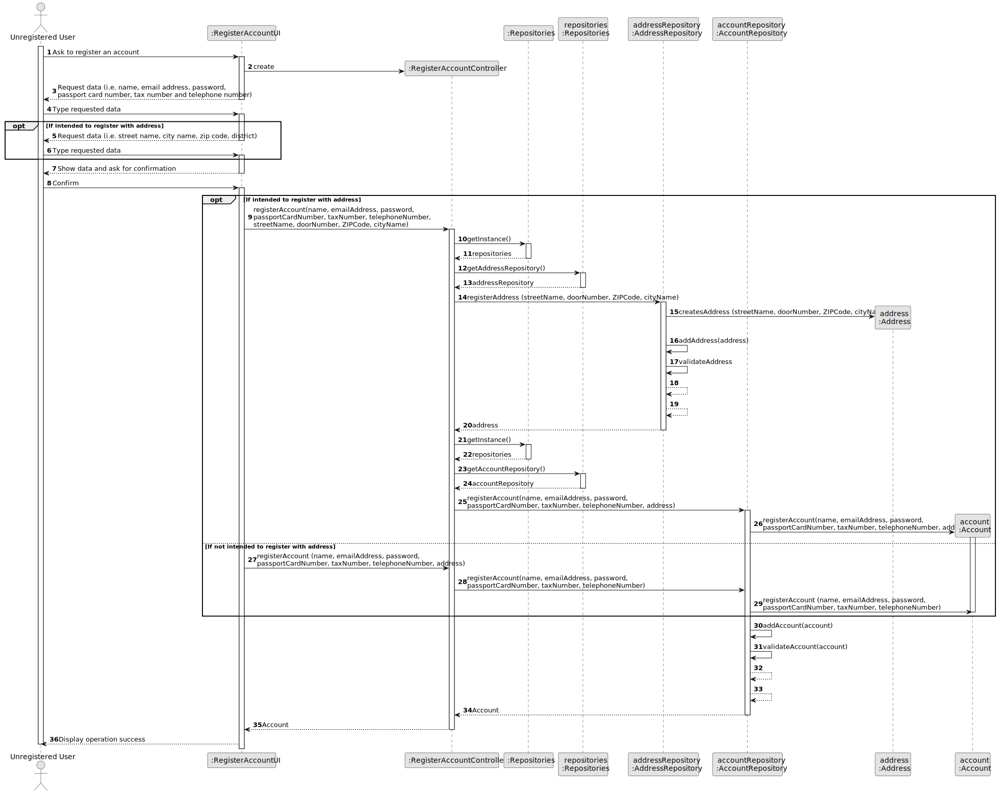
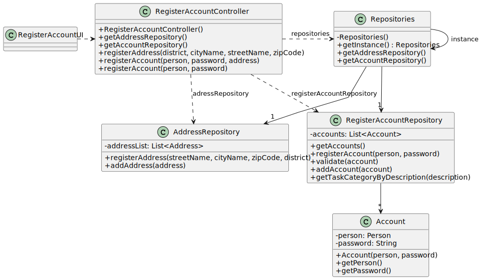

# US 007 - To register a client in the system

## 3. Design - User Story Realization 

### 3.1. Rationale

**SSD - Alternative 1 is adopted.**

| Interaction ID                                                                                                                            | Question: Which class is responsible for... | Answer                    | Justification (with patterns)                                                         |
|:------------------------------------------------------------------------------------------------------------------------------------------|:--------------------------------------------|:--------------------------|:--------------------------------------------------------------------------------------|
| Step 1: ask to register an account   		                                                                                                   | ...interacting with the actor?              | RegisterAccountUI         | Pure Fabrication                                                                      |
| 			  		                                                                                                                                   | ...coordinating the US?                     | RegisterAccountController | Controller                                                                            |
| 			  		                                                                                                                                   | ...knowing the addresses in the system?     | AddressRepository         | Creator (Rule 1): AddressRepository contains all the addresses present in the system. |
| 			  		                                                                                                                                   | ... knowing the accounts in the system?     | AccountRepository         | Creator (Rule 2): AccountRepository contains all the accounts present in the system.  |
| Step 2: request data (i.e. name, email address, name, email address, password,\npassport card number, tax number and telephone number) 		 | ...displaying the data? 							             | RegisterAccountUI         | Pure Fabrication                                                                      |
|                                                                                                                                           | ...registering the account?                 | Account                   | Information Expert. The object created has its own data.                              |
| Step 3: type requested data  		                                                                                                           | ...validating the data?                     | RegisterAccountUI         | Pure Fabrication                                                                      |
| Step 4: request data (i.e. street name, city name, zip code, district)   		                                                               | ...displaying the data?                     | RegisterAccountUI         | Pure Fabrication                                                                      |
|                                                                                                                                           | ...creating the address?                    | Address                   | Information Expert. The object created has its own data.                              |
| Step 5: type requested data  		                                                                                                           | ...validating the data?                     | RegisterAccountUI         | Pure Fabrication                                                                      |
| Step 6: show data and ask for confirmation  		                                                                                            | ...displaying a summary of submitted data?  | RegisterAccountUI         | Pure Fabrication                                                                      |              
| Step 7: confirm 		                                                                                                                        | ...validating the data?	                    | AccountRepository         | Information Expert. The object created has its own data.                              | 
| Step 8: display operation success  		                                                                                                     | 	...informing operation success?            | CreateTaskUI              | IE: is responsible for user interactions.                                             | 

### Systematization ##

According to the taken rationale, the conceptual classes promoted to software classes are: 

 * Account
 * Address

Other software classes (i.e. Pure Fabrication) identified: 

 * RegisterAccountUI  
 * RegisterAccountController
 * AccountRepository
 * AddressRepository

## 3.2. Sequence Diagram (SD)

### Alternative 1 - Full Diagram

This diagram shows the full sequence of interactions between the classes involved in the realization of this user story.

## 3.3. Class Diagram (CD)

