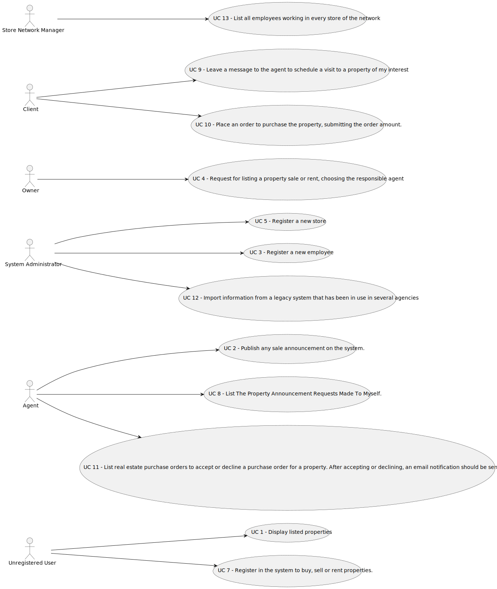

# Use Case Diagram (UCD)

# Use Cases / User Stories

| UC/US  | Description                                                                                     |                   
|:-------|:------------------------------------------------------------------------------------------------|
| US 01  | [Listed Properties](../../us001/Readme.md)                                                      |
| US 02  | [Sale Announcement](../../us002/Readme.md)                                                      |
| US 03  | [Register New Employee](../../us003/Readme.md)                                                  |
| US 04  | [Request to List a Propertie](../../us004/Readme.md)                                            |
| US 05  | [Register New Store](../../us005/Readme.md)                                                     |
| US 07  | [Register In The Sistem To Buy, Sell Or Rent Properties](../../us007/Readme.md)                 |
| US 08  | [List The Property Announcement Requests Made To Myself](../../us008/Readme.md)                 |
| US 09  | [Leave A Message To The Agent To Schedule A Visit to A Property](../../us009/Readme.md)         |
| US 010 | [Place An Order To Purchase The Property, Submitting The Orderamount](../../us010/Readme.md)    |
| US 011 | [List Real Estate Purchase Orders To Accept Or Decline A Purchase Order](../../us011/Readme.md) |
| US 012 | [Import Information From A Legacy System](../../us012/Readme.md)                                |
| US 013 | [List All Employees Working In Every Store Of The Network](../../us013/Readme.md)               |

