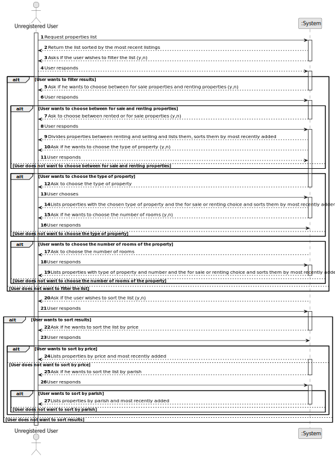

# US 001 -  To display listed properties

## 1. Requirements Engineering

### 1.1. User Story Description

As an unregistered user, I want to display listed properties.

### 1.2. Customer Specifications and Clarifications

**From the specifications document:**

> The unregistered user must have access to the properties' list. The user may also have the choice to make an appointment to visit the property.

**From the client clarifications:**

> **Question:** In the project's documentation it's mentioned that "All those who wish to use the application must be authenticated", but in the US1 it's said that an unregistered user can see a list of properties. Can users who aren't authenticated do this?
>
> **Answer:** Non-authenticated users can only list properties.

> **Question:** The properties can be in sale and lease at the same time?
>
> **Answer:** No.

> **Question:** In the project description it is stated that "the client is, then, responsible for being able to consult the properties by type, number of rooms, and sort by criteria such as price or the parish where the property is located.". Is the client able to sort properties by only these 4 criteria or is he able to sort properties by any of the properties' characteristics?
>
> **Answer:** The client should be able to select the type of business (renting or buying), the type of property and the number of rooms. Then, the client should be able to sort properties by price or by parish where the property is located.
If the client does not select the type of business, the type of property and the number of rooms, the application should allow the client to sort all properties that are on sale or on renting.

> **Question:** An unregistered user can olny see sale announcements or he is able to contact the agency agents to make a purchase request ?
>
> **Answer:** From the project description: "As an unregistered user, I want to display listed properties". For now this is the only functionality of the system that the non-registered user can use.

> **Question:** When an unregistered user opens the application, are there already properties being listed? If the answer is "YES": then by default, by which criteria are the properties listed? If the answer is "NO": is it mandatory for the user to choose an option (type, number of rooms) or can he/her simply request to view a list of properties that will be automatically ordered, for example, by "most recent"?
>
> **Answer:** I already clarified what the unregistered user will see and what he can do within the application. If the system does not contain any properties, the system should show an empty list of properties.

> **Question:** The property size, location and type are typed or selected in order to filter the results?
>
> **Answer:** I think you are asking about US1. The client should be able to select (from a list) the type of business, the type of property and the number of rooms.

> **Question:**  When a unregistered user wants to list properties, the list given by the program is sorted by default with which criteria? For example the list is shown with the properties sorted by most recently added?
> 
> **Answer:** Thank you for your suggestion. By default, the list should be shown with the properties sorted by most recently added.

> **Question:** Can an user filter the properties list for example by a type but choosing multiple values? For example the users wants to see only properties with 3 or 4 rooms. If this is possible, after filtering the list to show only the values chosen, he can sort by ascending/descending?
> 
> **Answer:** The user should select only one value for each feature of the property. By default, the list should be shown with the properties sorted by most recently added.

> **Question:**  In a previous question, you answered that, regarding US001 filtering/sorting system, the client should be able to select (from a list) the type of business, the type of property, and the number of rooms. Does this apply too to the process of an owner submitting a request? Or does the owner has to type these characteristics?
>
> **Answer:** Yes.

> **Question:** The one of the search criteria is "number of rooms". Is "Number of Bedrooms" or "Number of Bathrooms" or both?
>
> **Answer:** Number of Bedrooms.

> **Question:** The order which the properties are sorted by default is an ascending (for price from lowest to highest and for parish from A to Z) or in a descending order?
>
> **Answer:** The client should be able to sort (ascending or descending) properties by price, city and state. By default, the list should be shown with the properties sorted by most recently added.

> **Question:** In a previous question, you said that the address doesn't include parishes ("In the USA, the addresses will not include municipalities or parishes."). That being said, how should we sort the properties by location, specifically city, and state?
> 
> **Answer:** The client should be able to sort properties by price, city and state.

> **Question:**  Does a rent request includes a contract duration (minimum or defined)?
>
> **Answer:** The caracteristics for a rental are the same as the ones for the sale of a property. The rent value is per month. Additionally, we have to define the contract duration. Ther is no minimum.

> **Question:** When sorting by price or location: 1) Does it mean ascending or descending? Most expensive to least expensive or vice-versa. By closest to furthest or vice-versa. 2) To filter between a range of price? 3) To filter the location of the property by city?
>
> **Answer:** The client should be able to sort (ascending or descending) properties by price, city and state. I do not want the filters that you are suggesting.

### 1.3. Acceptance Criteria

* **AC1:** The user must have the option to choose between renting or leasing properties, the types of properties (apartments, houses or lands), the number of rooms
and being able to sort the properties by prices and by parishes.

### 1.4. Found out Dependencies

There is a dependency to "US002 publish a sale" since there must exist properties to be displayed to the unregisted users.

### 1.5 Input and Output Data

**Input Data:**

* Selected data:
  * type of business (rent or lease)
  * type of property
  * number of rooms
  * sort by price
  * sort by parish

**Output Data:**

(In)Success of the operation
Properties display

### 1.6. System Sequence Diagram (SSD)

#### Alternative One

### 1.7 Other Relevant Remarks

* n/a