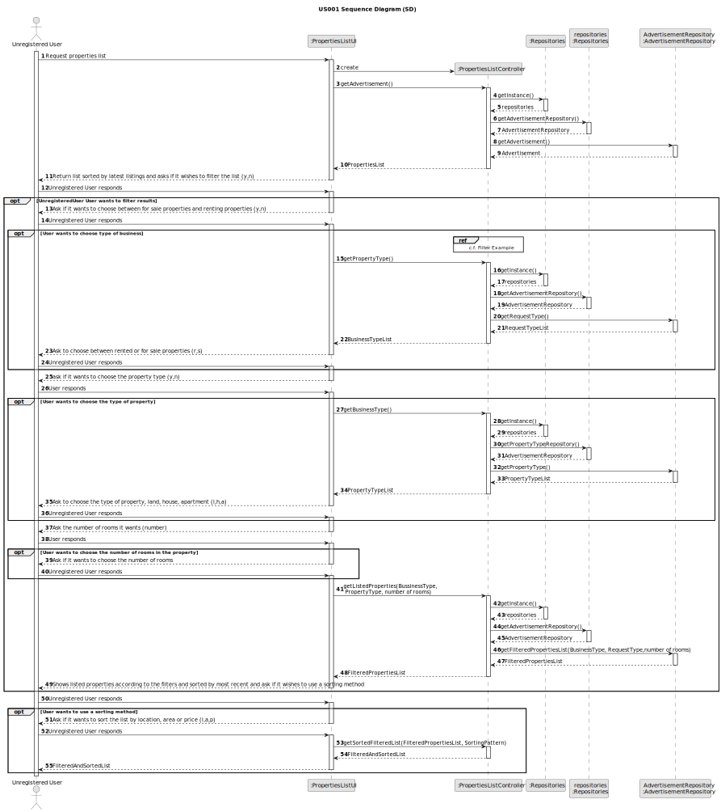
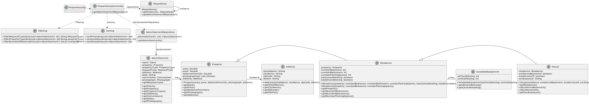

# US 001 - To create a Task

## 3. Design - User Story Realization

### 3.1. Rationale

**SSD - Alternative 1 is adopted.**

| Interaction ID | Question: Which class is responsible for...  | Answer                   | Justification (with patterns)                                                                                 |
|:---------------|:---------------------------------------------|:-------------------------|:--------------------------------------------------------------------------------------------------------------|
| Step 1  		     | 	... interacting with the actor?             | PropertiesListUI         | Pure Fabrication: there is no reason to assign this responsibility to any existing class in the Domain Model. |
| 			  		        | 	... coordinating the UI?                    | PropertiesListController | Controller                                                                                                    |
| Step 2  		     | 	...hold the search information?						       | PropertiesListController | Controller has the function to retrieve the repositories                                                      |
| Step 3  		     | 	...retrieving the repository?               | Task                     | IE: object created in step 1 has its own data.                                                                |
| Step 4  		     | 	...knowing the task categories to show?     | System                   | IE: Task Categories are defined by the Administrators.                                                        |
| Step 5  		     | 	... saving the selected category?           | Task                     | IE: object created in step 1 is classified in one Category.                                                   |
| Step 6  		     | 							                                      |                          |                                                                                                               |              
| Step 7  		     | 	... validating all data (local validation)? | Task                     | IE: owns its data.                                                                                            | 
### Systematization ##

According to the taken rationale, the conceptual classes promoted to software classes are:

* Property

Other software classes (i.e. Pure Fabrication) identified:

* PropertiesListUI
* PropertiesListController

## 3.2. Sequence Diagram (SD)

### Alternative 1 - Full Diagram

This diagram shows the full sequence of interactions between the classes involved in the realization of this user story.

## 3.3. Class Diagram (CD)

