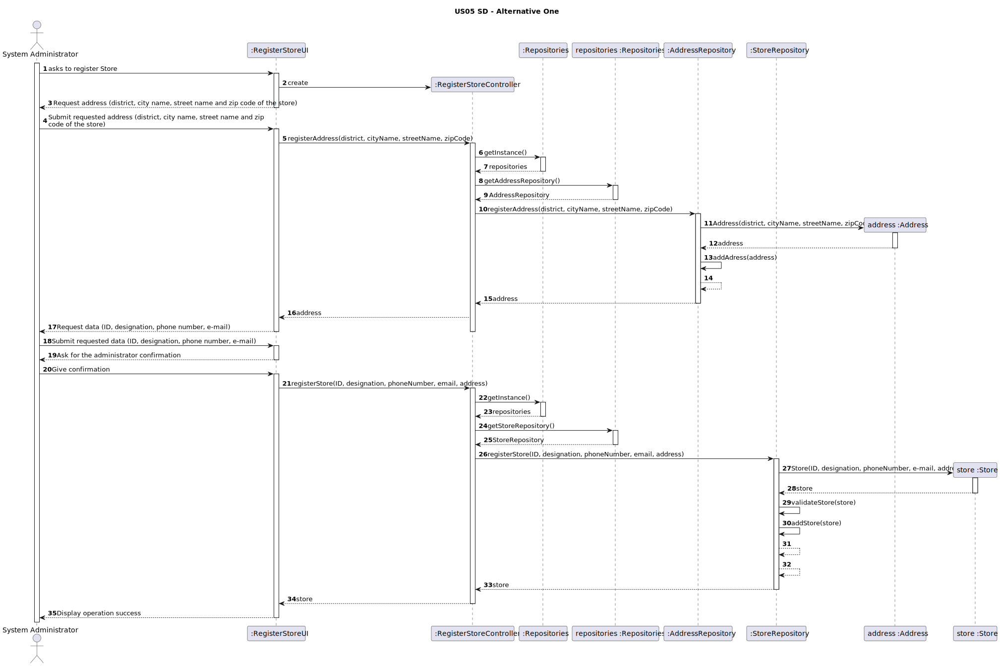
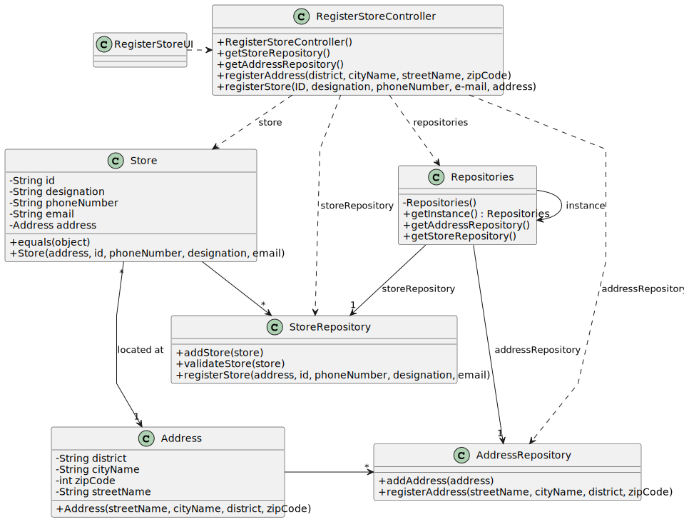

# US 005 - To register a new Store 

## 3. Design - User Story Realization 

### 3.1. Rationale

**SSD - Alternative 1 is adopted.**

| Interaction ID                                                                                   | Question: Which class is responsible for... | Answer                  | Justification (with patterns)                                                         |
|:-------------------------------------------------------------------------------------------------|:--------------------------------------------|:------------------------|:--------------------------------------------------------------------------------------|
| Step 1: The Administrator asks to register a store      	                                        | 	... interacting with the actor?            | RegisterStoreUI         | Pure Fabrication                                                                      |
| 			  		                                                                                          | 	... coordinating the US?                   | RegisterStoreController | Controller                                                                            |
| 			  		                                                                                          | 	...knowing the addresses in the system?    | AddressRepository       | Creator (Rule 1): AddressRepository contains all the addresses present in the system. |
| 			  		                                                                                          | ... knowing the stores in the system?       | StoreRepository         | Creator (Rule 2): StoreRepository contains all the stores present in the system.      |
| Step 2:  Request address (district, city name, street name and zip code of the store)  		  		    | ...displaying the data? 					               | RegisterStoreUI         | Pure Fabrication                                                                      |
|                                                                                                  | ...registering a address?                   | Address                 | Information Expert. The object created has its own data.                              |
| Step 3:  Submit requested address (district, city name, street name and zip code of the store) 	 | ...validating the data?                     | RegisterStoreUI         | Pure Fabrication                                                                      |
| Step 4:  Request data (ID, designation, phoneNumber, email, address)	                            | ...displaying the data?                     | RegisterStoreUI         | Pure Fabrication                                                                      |
|                                                                                                  | ...registering a store?                     | Store                   | Information Expert. The object created has its own data.                              |
| Step 5:  Submit requested data (ID, designation, phoneNumber, email, address) 		                 | 	...validating the data?                    | RegisterStoreUI         | Pure Fabrication                                                                      |
| Step 6:  Ask for the administrator confirmation                                                  | ...displaying a summary of submitted data?  | RegisterStoreUI         | Pure Fabrication                                                                      |
| Step 7:  Give confirmation  		                                                                   | 	...validating the data?                    | RegisterStoreUI         | Pure Fabrication                                                                      |
| Step 8:  Display operation success 		                                                            | 	...informing operation success?            | RegisterStoreUI         | Pure Fabrication                                                                      | 

### Systematization ##

According to the taken rationale, the conceptual classes promoted to software classes are: 

 * Store
 * Address

Other software classes (i.e. Pure Fabrication) identified: 

 * RegisterStoreUI  
 * RegisterStoreController
 * AddressRepository
 * StoreRepository

## 3.2. Sequence Diagram (SD)

### Alternative 1 - Full Diagram

This diagram shows the full sequence of interactions between the classes involved in the realization of this user story.

## 3.3. Class Diagram (CD)

