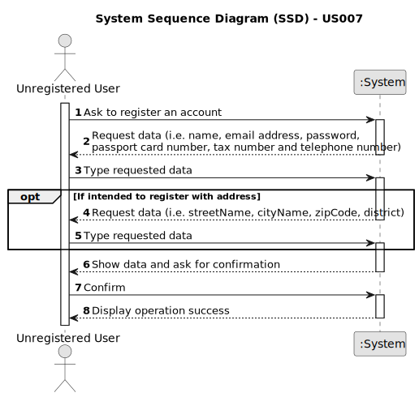

# US 007 - To register a client in the system

## 1. Requirements Engineering

### 1.1. User Story Description

As an unregistered user, I want to register in the system to buy, sell or rent
properties.

### 1.2. Customer Specifications and Clarifications 

**From the specifications document:**

> Owners go to one of the company's branches and meet with a real estate agent to sell or rent one or more properties, or they can use the company's application for the same purposes.

**From the client clarifications:**

> **Question:** Does the user also receive the password via email or can he choose a password when registering?
> 
> **Answer:** The owner can choose a password when registering.

> **Question:** When an unregistered user wants to register a new account in the system, the set of parameters that are asked are the following: name, citizen card number, tax number, email, phone number, and password. Do you want any extra parameters/requirements to be asked or just the ones specified above? If so, which ones are mandatory?
>
> **Answer:** The Owner attributes are: the name, the citizen's card number, the tax number, the address, the email address and the contact telephone number. The address of the owner is not mandatory.

> **Question:** It was previously stated that an unregistered user could do a property listing request. However, with the introduction of US007, I want to clarify and make sure that now a user needs to be registered in order to buy, sell or rent properties, or if they can still do it unregistered?
>
> **Answer:** In Sprint B we introduce US7 and now, in US4, the owner needs to be registered in the system to submit a request for listing. You should update all artifacts to include this change.

> **Question:** You said that the owner can choose a password, but how many letters, numbers... it needs to have?
> 
> **Answer:** All those who wish to use the application must be authenticated with a password of seven alphanumeric characters, including three capital letters and two digits.

> **Question:** When registering a user, should the application ask if they are registering as a client or an Owner?
> 
>  **Answer:** No. When registering a user, in US7, we are registering a user that can buy, sell or rent property. After registering, when this user logins in the system, the user should have access to both owner and client functionalities.

### 1.3. Acceptance Criteria

* **AC1:** The user needs to be registered in the system in order to buy, sell or rent properties.
* **AC2:** All those who wish to use the application must be authenticated with a password of seven alphanumeric characters, including three capital letters and two digits.

### 1.4. Found out Dependencies

*  There is no dependencies.

### 1.5 Input and Output Data

**Input Data:**

* Typed data:
	* name
	* email address
    * password
	* passport card number	
	* tax number
    * phone number
    * address (streetName, cityName, zipCode, district)

**Output Data:**

* (In)Success of the operation

### 1.6. System Sequence Diagram (SSD)

**Other alternatives might exist.**

#### Alternative One

### 1.7 Other Relevant Remarks

* None