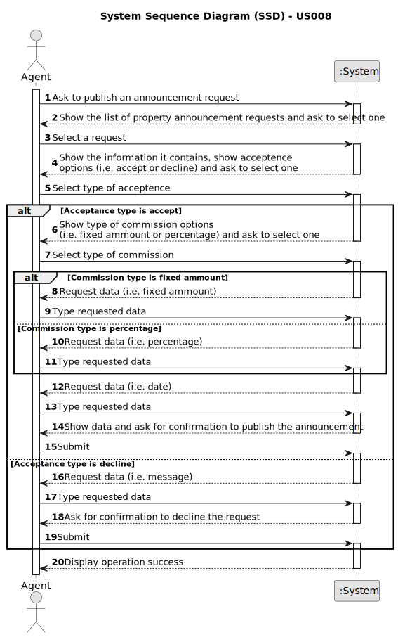

# US 008 - To post the announcement request

## 1. Requirements Engineering

### 1.1. User Story Description

As an agent, I intend to see the list of property announcement requests made to myself, so that I can post the announcement.

### 1.2. Customer Specifications and Clarifications 

**From the specifications document:**

> The owner provides property characteristics and the requested price and sends the request to an agent.
Upon receiving the order, the agent sets the commission and publishes the offer in the system. The
commission can be a fixed amount or a percentage.

> The real estate agent reviews advertisement requests, registers the information in the system and
publishes the offer so that it is visible to all clients who visit the agency and use the application.

**From the client clarifications:**
Thursday, 4 of May 2023
> **Question:** When displaying the property announcement requests in the system to the agent besides them being ordered 
from most recent to oldest is there a need to display the specific day, where the requests were published?
>
> **Answer:** The list of property announcement requests should be sorted by the date they were created, with the **most 
recent requests appearing first**. The system should show the date when the property announcement requests was made.

Thursday, 4 of May 2023
> **Question:** Can the agent select multiple requests at the same time?
> 
> **Answer:** No. The agent can only post **one announcement at a time**.

Sunday, 7 of May 2023
> **Question:** Can the agent decline an announcement request?
>
> **Answer:** Yes. The agent must include a **message justifying the rejection**.

Tuesday, 9 of May 2023
> **Question:** Will it be necessary to show search criteria? If so, which ones?
>
> **Answer:** There is no search criteria.

Tuesday, 16 of May 2023
> **Question:** Is the owner responsible to assigning the property to an agent or there are other ways to do that?
>
> **Answer:** (...)In this US the agent is the actor. The owner chooses the responsible agent in one other US.(...)

Friday, 19 of May 2023
> **Question:** Does the customer have any say in setting the commission (agree or deny, eg: commission too high so, I withdraw the ad request)
or is the commission solely set by the agent without customer approval?
>
> **Answer:** The agent should, firstly, set the commission and then publishes the offer in the system. The sale price (the USD value that is 
shown in the announcement) should include the commission value (owner requested price + commission) and should **not show the commission**. 
The commission is only specified when the agent accepts the request.

Friday, 19 of May 2023
> **Question:** Does the request once it's declined by the agent be deleted from the request list?
>
> **Answer:** The announcement request should **not be shown again** to the agent. We never delete information from our system.4

Friday, 19 of May 2023
> **Question:** Besides the creation of a message justifiyng the rejection should a message or an email be sent to the client.
>
> **Answer:** The system should also send the **message to the owner by e-mail**.

Friday, 19 of May 2023
> **Question:** Since as an agent I intend to see the advertisement requests made to me in order to publish the chosen advertisement
after consulting the list, why should there be an option to reject it since the previously chosen advertisement had already the intention
of being published.The rejection operation shouldn't be described as another feature?
>
> **Answer:** I want to check all property announcement requests and have the option to accept or reject any announcement request. 
The property owner is a human being and can make errors like any other human being...

### 1.3. Acceptance Criteria

* **AC1:** The list of property announcement requests should be sorted by the date they were created, with the most recent requests appearing first.
* **AC2:** An announcement is posted when a request is accepted. The list of requests should be refreshed, and that request should not be shown again.
* **AC3:** The agent can only post an announcement at a time.
* **AC4:** The agent should justify a rejection with a message to the owner by email.

### 1.4. Found out Dependencies

* There is a dependency to "US003 To register a new employee" because for the agent to be able to publish the announcement request,
  he needs to be registered in the system as an employee.

* There is a dependency to "US004 To submit a request" because the agent is only able to publish the announcement if there is
  a request for listing a property sale or rent submitted by the owner.

* There is a dependency to "US007 To register a client in the system" because the owner who is contacting the agent
  must be registered in the system.

### 1.5 Input and Output Data

**Input Data:**

* Typed data:
	* Fixed ammount
    * Percentage
	* Date
    * Message

* Selected data:
	* Type of acceptance
	* Type of commission

**Output Data:**
* Sale announcement published
* (In)Success of the operation

### 1.6. System Sequence Diagram (SSD)

**Other alternatives might exist.**

#### Alternative One

### 1.7 Other Relevant Remarks

* All registered information, except the agency commission and the owner´s email, can be accessed by the client who intends to buy or rent the property.