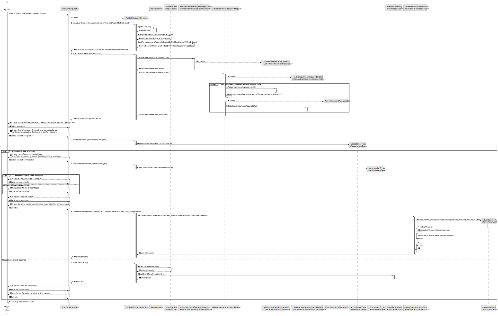
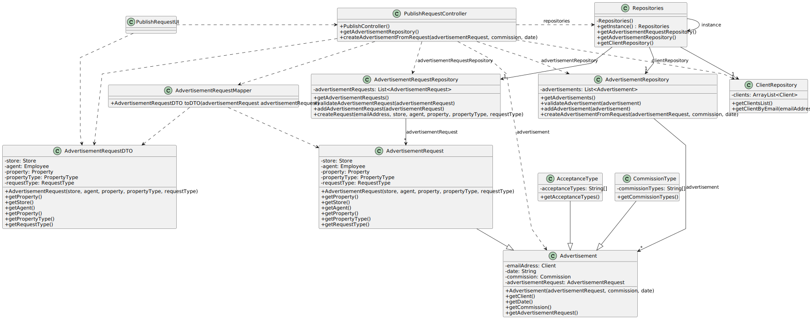

# US 007 - To register a client in the system

## 3. Design - User Story Realization 

### 3.1. Rationale

**SSD - Alternative 1 is adopted.**

| Interaction ID                                                                                                        | Question: Which class is responsible for...                | Answer                         | Justification (with patterns)                                                                                   |
|:----------------------------------------------------------------------------------------------------------------------|:-----------------------------------------------------------|:-------------------------------|:----------------------------------------------------------------------------------------------------------------|
| Step 1: ask to publish an announcement request 	                                                                      | ...interacting with the agent?                             | PublishRequestUI               | Pure Fabrication                                                                                                |
| 			  		                                                                                                               | ...coordinating the US?                                    | PublishRequestController       | Controller                                                                                                      |
| 			  		                                                                                                               | ...knowing the advertisement requests lists in the system? | AdvertisementRequestRepository | Creator (Rule 1): AdvertisementRequestRepository contains all the advertisement requests present in the system. |
| Step 2: show the list of property announcement requests and ask to select one   		                                    | ...displaying the data? 							                            | PublishRequestUI               | Pure Fabrication                                                                                                |
| Step 3: select a request	                                                                                             | ...saving the inputted data?                               | Advertisement                  | IE: object created in step 1 has its own data.                                                                  |
| Step 4: show the information it contains, show acceptence options (i.e. accept or decline) and ask to select one   		 | ...displaying the data?                                    | PublishRequestUI               | Pure Fabrication                                                                                                |
| Step 5: select type of acceptance  		                                                                                 | 	...selects the type of acceptance?                        | PublishRequestUI               | Pure Fabrication                                                                                                |
|                                                                                                                       | ...setting type of commission?                             | CommissionType                 | Pure Fabrication                                                                                                |
| Step 6: show type of commission options (i.e. fixed amount or percentage) and ask to select one 		                    | ...displaying types of commissions options?							         | PublishUI                      | Pure Fabrication                                                                                                |
| Step 7: select type of commission  		                                                                                 | 	...selects the type of commissions?                       | PublishRequestUI               | Pure Fabrication                                                                                                |
|                                                                                                                       | ...setting type of commission?                             | CommissionType                 | Pure Fabrication                                                                                                |
| Step 8: request data (i.e. fixed amount)                                                                              | ...displaying the data?                                    | PublishRequestUI               | Pure Fabrication                                                                                                |
| Step 9: type requested data                                                                                           | ...validating submitted data?                              | Advertisement                  | IE: object created in step 1 has its own data.                                                                  |
| Step 10: request data (i.e. percentage)                                                                               | ...displaying the data?                                    | PublishRequestUI               | Pure Fabrication                                                                                                |
| Step 11: type request data                                                                                            | ...validating submitted data?                              | Advertisement                  | IE: object created in step 1 has its own data.                                                                  |
| Step 12: request data (i.e. date)                                                                                     | ...displaying the data?                                    | PublishRequestUI               | Pure Fabrication                                                                                                |
| Step 13: type request data                                                                                            | ...validating submitted data?                              | Advertisement                  | IE: object created in step 1 has its own data.                                                                  |
| Step 14: show data and ask for confirmation to publish the announcement 		                                            | ...displaying a summary of submitted data?                 | PublishRequestUI               | Pure Fabrication                                                                                                |              
| Step 15: submit 		                                                                                                    | ...validating the data?	                                   | AdvertisementRepository        | IE: knows all its advertisements                                                                                | 
|                                                                                                                       | ...saving the created advertisement?                       | AdvertisementRepository        | IE: owns all its advertisements                                                                                 |
|                                                                                                                       | ...knowing the client's email in the system?               | ClientRepository               | Creator (Rule 1): ClientRepository contains all the client's information present in the system.                 |
| Step 16: request data (i.e. message)                                                                                  | ...displaying the data?                                    | PublishRequestUI               | Pure Fabrication                                                                                                |
| Step 17: type request data                                                                                            | ...validating submitted data?                              | Advertisement                  | IE: object created in step 1 has its own data.                                                                  |
| Step 18: ask for confirmation to decline the request  		                                                              | ...displaying submitted data?                              | PublishRequestUI               | Pure Fabrication                                                                                                |              
| Step 19: submit 		                                                                                                    | ...validating the data?	                                   | PublishRequestUI               | Pure Fabrication                                                                                                |
| Step 20: display operation success  		                                                                                | 	...informing operation success?                           | PublishRequestUI               | IE: is responsible for user interactions.                                                                       | 

### Systematization ##

According to the taken rationale, the conceptual classes promoted to software classes are: 

 * AcceptanceType
 * CommissionType
 * Advertisement

Other software classes (i.e. Pure Fabrication) identified: 

 * PublishRequestUI 
 * PublishRequestController
 * AdvertisementRequestRepository
 * ClientRepository
 * AdvertisementRepository

## 3.2. Sequence Diagram (SD)

### Alternative 1 - Full Diagram

This diagram shows the full sequence of interactions between the classes involved in the realization of this user story.

## 3.3. Class Diagram (CD)

